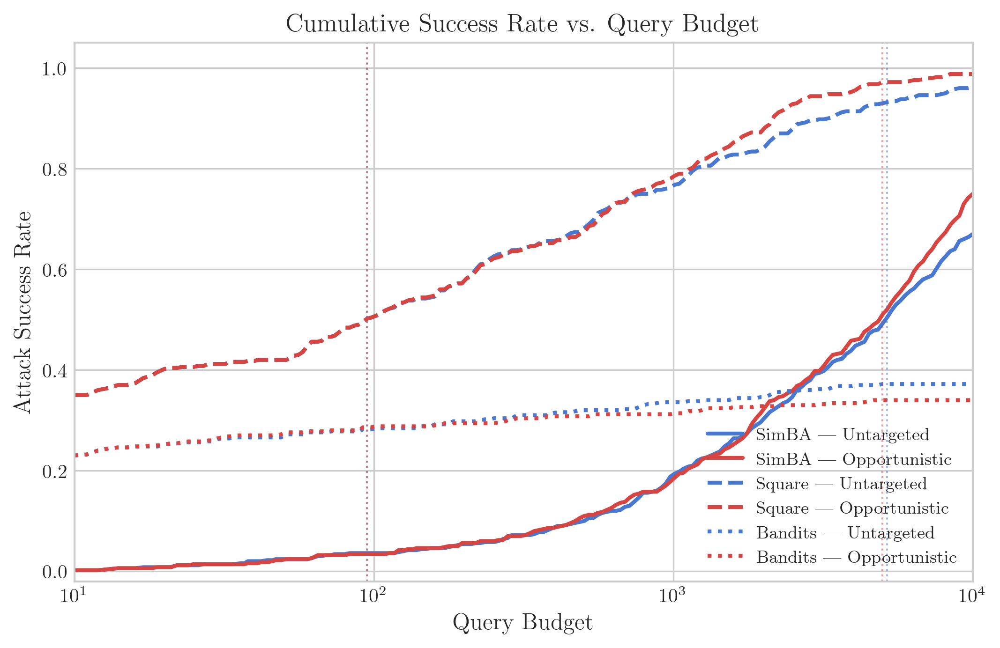
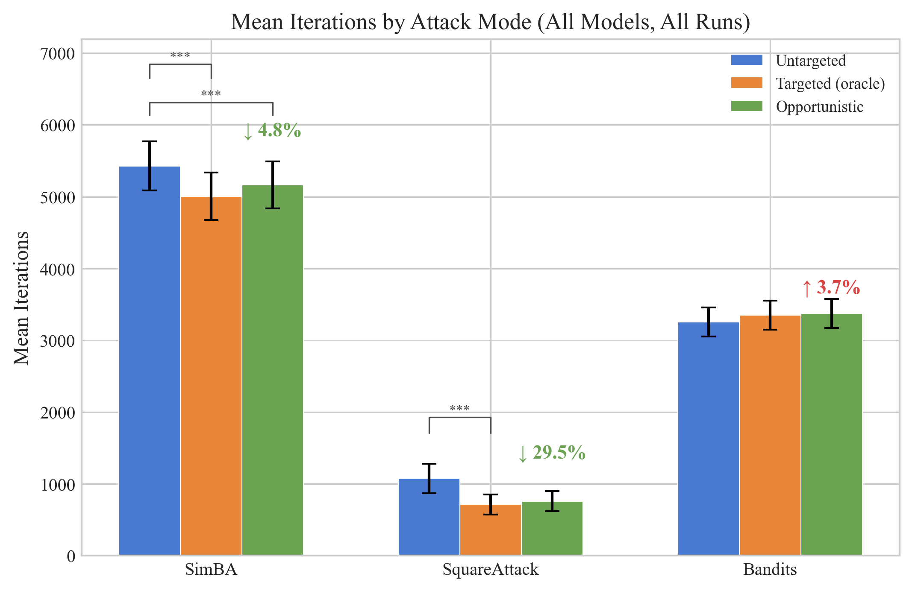
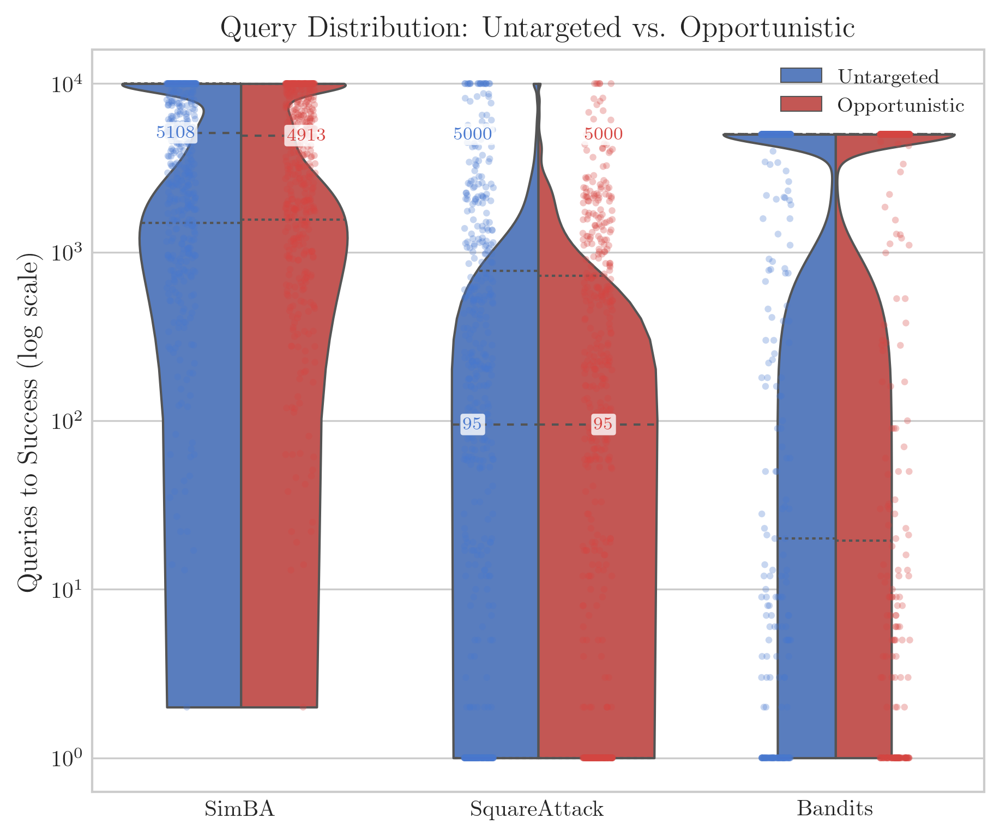
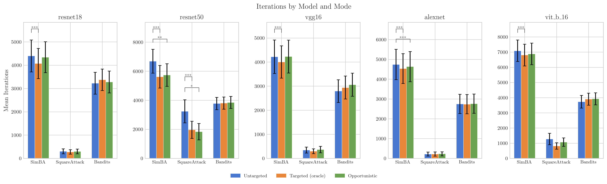
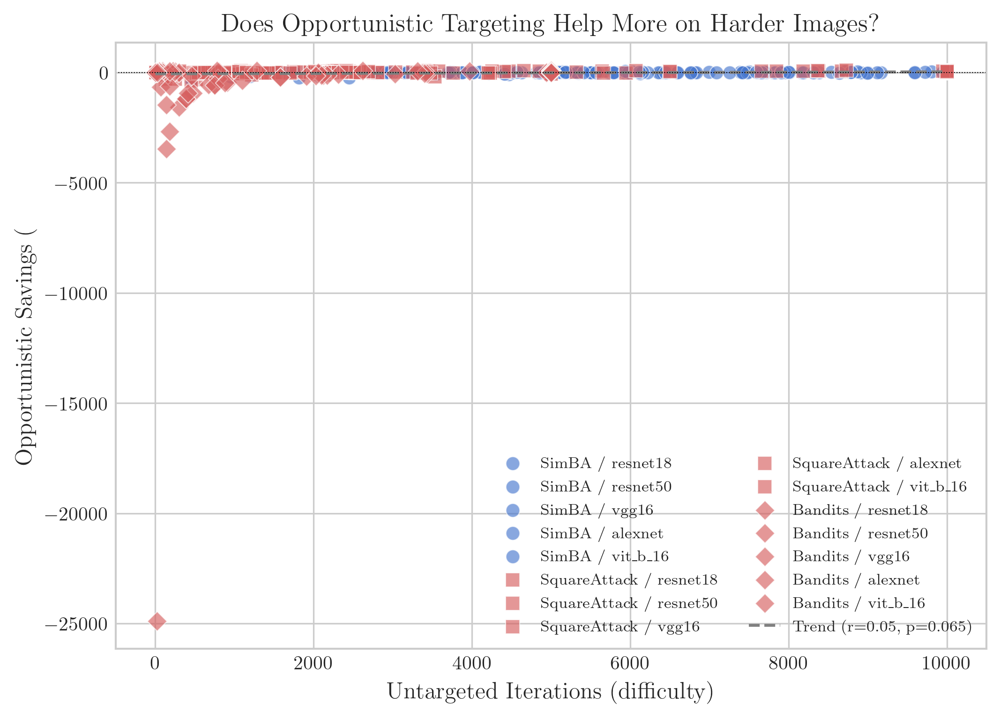
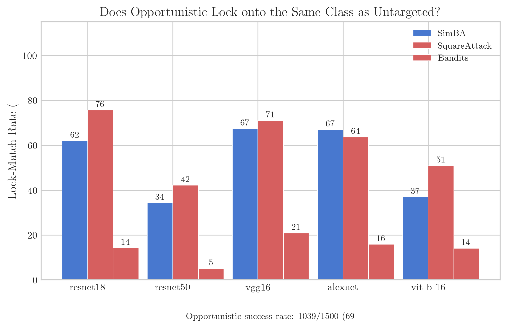
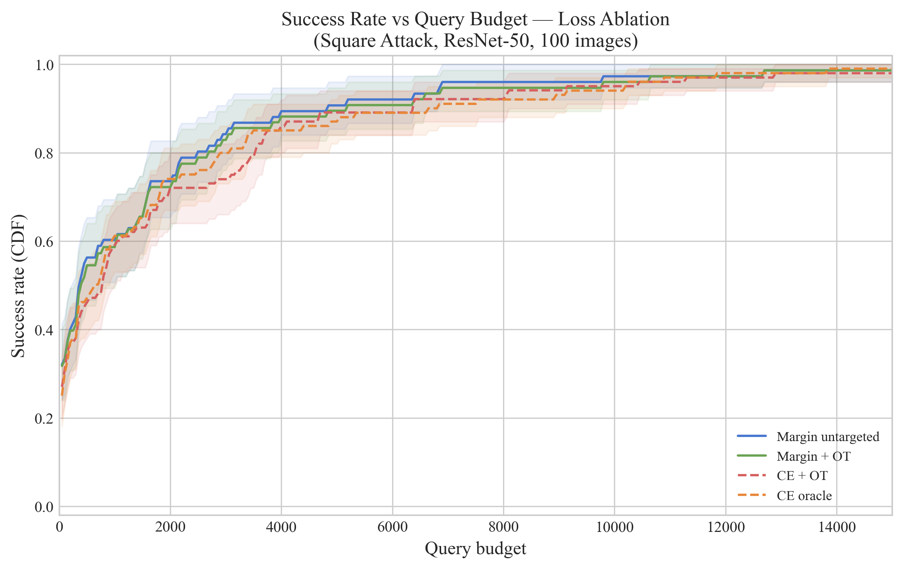

# Opportunistic Targeting: A Rank-Stability Heuristic for Query-Efficient Black-Box Adversarial Attacks

---

## Abstract

Black-box adversarial attacks that minimize only the ground-truth confidence suffer from *latent-space drift*: perturbations wander through the feature space without committing to a specific adversarial class, wasting queries on diffuse, undirected progress. We introduce **Opportunistic Targeting (OT)**, a lightweight wrapper that monitors the rank stability of the leading non-true class during an untargeted attack and dynamically switches to a targeted objective once a stable candidate emerges. OT requires no architectural modification to the underlying attack, no gradient access, and no *a priori* target-class knowledge.

We validate OT on two representative score-based attacks, SimBA and Square Attack (cross-entropy loss), across four standard ImageNet classifiers (50-image benchmark, 1,200 runs). OT closely tracks oracle performance, improving SimBA success rate from 74% to 82.5% (oracle: 84%) and delivering 5.6% paired query savings on images where both modes succeed ($p < 10^{-9}$, Wilcoxon). Benefits scale with model depth (up to 34% query reduction on ResNet-50) and are confirmed on a 100-image benchmark with bootstrapped confidence intervals: OT closes the gap between untargeted and oracle success rates across the full query-budget range.

On adversarially-trained models, targeting mode has no statistically significant effect on either success rate or query efficiency. This neutrality holds across both models, both methods, and all tested stability thresholds, suggesting that robust loss landscapes offer no advantage to directional commitment over untargeted exploration.

---

## 1. Introduction

Standard untargeted black-box attacks operate by minimizing the model's confidence in the ground-truth class. This strategy, whether implemented as probability minimization in SimBA (Guo et al., 2019) or cross-entropy loss in Square Attack (Andriushchenko et al., 2020), treats all non-true classes as interchangeable. As the ground-truth confidence decreases, the freed probability mass spreads across the remaining classes without directional commitment. The adversarial perturbation effectively executes a random walk through the latent space, crossing class basins opportunistically rather than heading toward a specific decision boundary.

This *latent-space drift* directly impacts query efficiency. Each query spent exploring a class basin that will ultimately be abandoned is a wasted query. The deeper the model (and hence the higher-dimensional the feature space), the more basins the perturbation must traverse before settling, and the more pronounced the waste becomes. On a 50-layer residual network, an untargeted attack may require twice the queries needed to cross the *same* decision boundary that a targeted attack reaches directly.

Targeted attacks eliminate drift by construction: they push toward a fixed adversarial class from the first query. However, they require the attacker to specify a target class *a priori*, which is generally unavailable in a black-box setting. Choosing a suboptimal target can be worse than having no target at all, because the attack commits its entire budget to reaching a potentially distant or infeasible class.

Margin-based losses (Carlini and Wagner, 2017) offer a partial solution. By optimizing the gap between the ground-truth logit and the highest non-true logit, they implicitly track the nearest decision boundary at every iteration. The Square Attack paper's default loss is of this form, and it provides strong untargeted performance precisely because it encodes dynamic target selection into the loss function itself. However, not all attacks support margin losses. SimBA operates on raw probabilities; other attacks may use cross-entropy for compatibility or simplicity. For these methods, drift remains the main efficiency bottleneck.

**Opportunistic Targeting** bridges this gap. The key insight is that the information needed to select a good target class is already present in the attack's own trajectory: the class that an untargeted perturbation is naturally drifting toward is, by definition, the class whose decision boundary is most accessible. OT formalizes this observation through a rank-stability heuristic:

1. **Exploration phase.** The attack runs in standard untargeted mode. After each *accepted* perturbation (a step that improved the adversarial loss), we record which non-true class currently holds the highest predicted confidence.

2. **Stability check.** If the same class holds the top rank for $S$ consecutive accepted perturbations (the *stability threshold*), we declare it the opportunistic target.

3. **Exploitation phase.** The attack switches to a pure targeted objective against the locked class and runs until misclassification or budget exhaustion.

The stability threshold $S$ acts as a debouncing filter: it prevents the attack from locking onto volatile classes that spike due to random noise in early iterations, while remaining small enough that the exploration phase consumes a negligible fraction of the query budget.

This paper makes three contributions:

1. **A general-purpose wrapper** that adds opportunistic targeting to any score-based black-box attack, requiring only access to the predicted class distribution (not gradients or logits).

2. **Empirical validation** on standard ImageNet classifiers showing that OT provides near-oracle efficiency with zero *a priori* target knowledge, with benefits that scale predictably with model depth.

3. **A characterization of OT's failure mode** on adversarially-trained models, where flat confidence landscapes produce semantically plausible decoy targets that mislead the stability heuristic.

The remainder of this paper is organized as follows. Section 2 surveys related work on query-efficient black-box attacks. Section 3 describes the OT algorithm and its integration with SimBA and Square Attack. Section 4 details the experimental setup. Section 5 presents results on standard networks. Section 6 formalizes the connection between OT and margin-based losses. Section 7 reports ablation studies on the stability threshold and loss function. Section 8 extends the analysis to adversarially-trained models. Section 9 concludes.

---

## 2. Related Work

### 2.1 Score-Based Black-Box Attacks

Score-based (decision-score) attacks assume access to the full output probability vector but not to gradients. SimBA (Guo et al., 2019) iterates over an orthonormal basis (pixel or DCT), accepting perturbations that reduce the true-class probability. It requires only 1.4–1.5 queries per iteration on average and achieves high success rates on standard models. While SimBA could in principle adopt a margin-based acceptance criterion, its original formulation uses only the true-class probability, providing no mechanism for directing perturbations toward a specific adversarial class.

Square Attack (Andriushchenko et al., 2020) uses random square-shaped patches at the vertices of the $L_\infty$ ball, with a schedule that shrinks the patch size as the attack progresses. Its default margin loss $f_{y}(x) - \max_{k \neq y} f_k(x)$ implicitly tracks the nearest decision boundary. When run with cross-entropy loss instead, the margin guidance vanishes and the attack exhibits the same drift behavior as SimBA, making it an ideal testbed for isolating OT's contribution.

### 2.2 Decision-Based and Transfer Attacks

Decision-based attacks require only the top-1 label, not the full score vector. Recent work in this space focuses on geometric constructions: SurFree (Maho et al., 2021) uses random 2-D hyperplane search, and Gesny et al. (2024) show theoretically that reintroducing gradient estimation into SurFree (yielding CGBA) accelerates convergence of the angle $\theta(i)$ between the current perturbation direction and the optimal adversarial direction. This is loosely analogous to OT: both methods reintroduce directional information into a blind search process. The mechanisms differ in granularity — CGBA uses continuous gradient estimates updated at every iteration, while OT uses a discrete, one-time class identity lock — but the effect is similar: the perturbation converges faster toward a specific adversarial direction. We adopt the same angular convergence framework in Section 6.3 to quantify this effect empirically.

### 2.3 Attacks on Robust Models

Adversarially-trained models (Madry et al., 2018; Salman et al., 2020) present a qualitatively different challenge. Their flatter loss landscapes and more uniform confidence distributions mean that early-iteration class rankings are less informative. The robust-model experiments in Section 8 examine whether OT's rank-stability signal remains useful in this regime.

---

## 3. Method

### 3.1 Notation

Let $f: \mathcal{X} \to \mathbb{R}^K$ denote a classifier mapping inputs to logits over $K$ classes, and $P(k|x) = \text{softmax}(f(x))_k$ the predicted probability of class $k$. Given a correctly-classified input $x$ with true label $y$, the attacker seeks an adversarial example $x' = x + \delta$ such that $\arg\max_k P(k|x') \neq y$ and $\|\delta\|_\infty \leq \epsilon$.

### 3.2 Untargeted Loss and the Drift Problem

Standard untargeted attacks minimize a loss that depends only on the true class:

$$\mathcal{L}_{\text{untargeted}}(x', y) = P(y | x') \quad \text{(SimBA)} \qquad \text{or} \qquad \mathcal{L}_{\text{untargeted}}(x', y) = -\log P(y | x') \quad \text{(CE)}$$

These objectives decrease $P(y|x')$ without specifying where the freed probability mass should concentrate. In a $K$-class problem, the perturbation may distribute mass across hundreds of classes, crossing multiple class basins before any single competitor class exceeds the declining true-class confidence. We call this *latent-space drift*.

**Margin loss** avoids drift by construction:

$$\mathcal{L}_{\text{margin}}(x', y) = f_y(x') - \max_{k \neq y} f_k(x')$$

where $f_k(x')$ denotes the logit (pre-softmax score) for class $k$. The $\max_{k \neq y} f_k(x')$ term dynamically identifies the nearest competitor, providing implicit directionality at every iteration. Square Attack's default loss is of this form, explaining its strong untargeted performance.

### 3.3 Targeted Loss

A targeted attack toward class $t$ optimizes:

$$\mathcal{L}_{\text{targeted}}(x', t) = -P(t | x') \quad \text{(SimBA)} \qquad \text{or} \qquad \mathcal{L}_{\text{targeted}}(x', t) = \log P(t | x') \quad \text{(CE)}$$

Targeting eliminates drift but requires knowing $t$ in advance. An *oracle* target, i.e. the class that the unconstrained untargeted attack eventually reaches, provides a trajectory-specific performance ceiling that no real attacker can achieve (see Section 4.2 for a precise definition).

### 3.4 Opportunistic Targeting Algorithm

OT discovers the target class online by monitoring which adversarial class the perturbation is naturally drifting toward. The algorithm wraps any score-based attack without modifying its perturbation mechanism.

#### Algorithm 1: Opportunistic Targeting Wrapper

```text
Input: image x, true label y, attack A, stability threshold S
Output: adversarial example x'

1.  Initialize: x' ← x, locked ← False, target ← None, buffer ← circular buffer of size S
2.  while not misclassified(x') and budget not exhausted:
3.      mode ← targeted if locked else untargeted
4.      x' ← A.step(x', y if not locked else target, mode)
5.      if step was accepted:                          // loss improved
6.          c ← argmax_{k ≠ y} P(k | x')              // leading non-true class
7.          if not locked:
8.              buffer.append(c)
9.              if len(buffer) = S and all entries in buffer are identical:
10.                 target ← c
11.                 locked ← True
12. return x'
```

**Key design choices:**

- **Accepted perturbations only (line 5).** The stability counter increments only when the attack makes progress (reduces the loss). Rejected steps, which contribute no useful signal about the loss landscape, are ignored. This filters out noise from random, unproductive queries.

- **Consecutive stability (line 9).** The buffer must contain $S$ identical entries *in a row*. A single interruption resets the count. This strict debouncing prevents premature lock-in on volatile classes.

- **Irreversible lock (line 10–11).** Once a target is locked, the attack commits for the remainder of the budget. Releasing the lock would re-introduce the exploration overhead that OT is designed to eliminate.

### 3.5 Integration with SimBA

SimBA (Guo et al., 2019) perturbs the image along randomly-sampled orthonormal directions (pixel or DCT basis), accepting steps that improve the adversarial loss. Our implementation uses the DCT basis with 8×8 blocks, operating in $L_\infty$ with $\epsilon = 8/255$.

| Parameter | Value | Description |
| ----------- | ------- | ------------- |
| Basis | DCT (8×8 blocks) | Low-frequency directions; ~98% are descending |
| Step size | $\epsilon = 8/255$ | $L_\infty$ perturbation bound |
| Budget | 10,000 queries | Per-image query limit |
| Acceptance | $P(y\|x') < P(y\|x)$ (untargeted) | Greedy coordinate descent |

In untargeted mode, SimBA's acceptance criterion reduces $P(y|x')$, a single-class objective that, unlike margin loss, does not track the nearest competitor. Upon lock-in, the criterion switches to increasing $P(t|x')$ where $t$ is the locked target. The perturbation mechanism (basis selection, step size, acceptance rule) is unchanged; only the objective updates.

### 3.6 Integration with Square Attack (Cross-Entropy Loss)

Square Attack (Andriushchenko et al., 2020) samples random square patches at the vertices of the $L_\infty$ ball, with a patch size that decays according to a budget-dependent schedule. The schedule halves the patch fraction $p$ at iterations $\{10, 50, 200, 1000, 2000, 4000, 6000, 8000\}$ (for a 10,000-iteration budget), rescaling proportionally for other budgets.

**Important methodological note.** The patch schedule depends on the *total* budget $N$, not just the current iteration $i$. The `torchattacks` implementation normalizes via $\hat{i} = \lfloor i / N \times 10000 \rfloor$. This means iteration counts obtained under different budgets are **not comparable**: an attack with $N = 10\text{K}$ at iteration 5 used larger patches than one with $N = 1\text{K}$ at iteration 5. All our experiments use a fixed $N = 10\text{K}$ for Square Attack.

We run Square Attack with **cross-entropy loss** ($-\log P(y|x')$) rather than the default margin loss. This is a deliberate ablation: margin loss already provides implicit target tracking (Section 3.2), which would confound OT's contribution. With CE loss, the untargeted attack exhibits clear drift, and any efficiency gain can be attributed to OT.

| Parameter | Value | Description |
| ----------- | ------- | ------------- |
| Patch shape | Square, $L_\infty$ vertices | $\pm \epsilon$ per pixel |
| Loss | Cross-entropy | Drift-prone; no implicit targeting |
| Budget | $N = 10{,}000$ | Fixed for schedule comparability |
| $p$ schedule | Halved at $\{10, 50, 200, \ldots, 8000\}$ | Patch fraction decay |

---

## 4. Experimental Setup

### 4.1 Models

We evaluate on two model families:

**Standard (non-robust) ImageNet classifiers** from torchvision, wrapped with a `NormalizedModel` that applies ImageNet normalization internally so all attacks operate in $[0, 1]$ pixel space:

| Model | Depth | Parameters | Top-1 Accuracy |
| ------- | ------- | ----------- | ---------------- |
| AlexNet | 8 layers | 61M | 56.5% |
| ResNet-18 | 18 layers | 11.7M | 69.8% |
| VGG-16 | 16 layers | 138M | 71.6% |
| ResNet-50 | 50 layers | 25.6M | 76.1% |

**Adversarially-trained ImageNet classifiers** from RobustBench (Salman et al., 2020), with built-in normalization:

| Model | Architecture | Training |
| ------- | ------------- | ---------- |
| Salman2020Do\_R18 | ResNet-18 | PGD adversarial training |
| Salman2020Do\_R50 | ResNet-50 | PGD adversarial training |

### 4.2 Protocol

Each (model, attack, image) triplet is evaluated in three modes:

| Mode | Description |
| ------ | ------------- |
| **Untargeted** | Standard attack with no directional guidance. |
| **Targeted (oracle)** | Trajectory-specific ceiling: target class chosen *a posteriori* from the untargeted result. |
| **Opportunistic** | Our method: lock onto the leading non-true class once rank-stability threshold $S$ is reached. |

The oracle target is the class that the untargeted attack converges to (i.e., the final predicted class after misclassification), determined by running a probe untargeted attack with the same random seed. This represents a *trajectory-specific* ceiling on targeted performance: the oracle runs a targeted attack toward the class that the untargeted attack's own random search naturally discovered, which no real attacker could know *a priori*. Importantly, this oracle is not globally optimal — a different random seed or a geometry-based target selection (e.g., nearest decision boundary) might yield a more efficient target. We use it because it provides a reproducible, attack-specific reference point: it is the best target *for the perturbation path that the attack would have followed*.

### 4.3 Configuration

- **Perturbation budget:** $\epsilon = 8/255 \approx 0.031$ in $[0, 1]$ pixel space ($L_\infty$ norm). This is the standard ImageNet adversarial benchmark setting.
- **Query budget:** 10,000 iterations for both attacks (50-image benchmark) and 15,000 iterations (100-image winrate benchmark).
- **Stability threshold:** $S = 10$ for SimBA and $S = 8$ for Square Attack on standard models (validated by ablation, Section 7.1), $S = 10$ for both methods on robust models.

### 4.4 Images

**50-image benchmark:** 50 images randomly sampled from the ILSVRC2012 validation set. Each (model, method, image, mode) combination runs once at a 10K budget, yielding 1,200 runs (400 per mode) on standard models and 600 runs (200 per mode) on robust models.

**100-image benchmark:** 100 images sampled from the ILSVRC2012 validation set. Each (method, image, mode) combination runs once on ResNet-50 at a fixed 15K budget.

### 4.5 Metrics

The primary metric is **success rate** (higher is better): at equal query budgets, the attack that misclassifies more images wins. Following Ughi et al. (2021), we also report **success rate as a function of query budget** (CDF curves), which captures the full distribution of attack difficulty rather than reducing it to a single threshold.

As secondary metrics we report two variants of iteration counts, which capture distinct effects:

- **Censored mean iterations** (all runs): failed runs are assigned the budget ceiling (10K or 15K). This composite metric reflects *both* efficiency gains and success-rate gains: a mode that rescues more runs mechanically lowers the censored mean by replacing 10K-capped failures with finite counts.
- **Paired mean iterations** (both-succeed subset): restricted to images where *both* modes succeed, isolating pure query-efficiency differences from success-rate effects.

Both are informative: the censored mean captures OT's total practical value (faster *and* more successful), while the paired mean isolates the efficiency mechanism.

### 4.6 Budget Censoring

All iteration counts are right-censored at the query budget. Failed runs that hit the ceiling represent a *lower bound* on the true cost. This censoring biases *against* OT's reported savings: the true untargeted cost for hard cases may be 2 to 10 times higher, making our savings estimates conservative.

---

## 5. Results on Standard Networks

### 5.1 Success Rates

OT closely tracks oracle-targeted success rates: 82.5% for SimBA (vs. 74.0% untargeted, 84.0% oracle) and 97.5% for Square Attack (vs. 95.0% untargeted, 98.5% oracle). SimBA's untargeted mode fails on 26% of runs (predominantly on ResNet-50, where only 48% succeed), while OT rescues a substantial fraction, reaching 76% on ResNet-50.

### 5.2 CDF: Success Rate vs. Query Budget

The 100-image CDF benchmark on ResNet-50 (15K budget, 1000-sample percentile bootstrap, 90% CI bands) confirms these findings at scale.


**Figure 1: SimBA success rate vs. query budget** (ResNet-50, 100 images). OT (green) matches oracle-targeted performance (orange) exactly at 85%, a +32 percentage point gain over untargeted (53%). The curves overlap almost entirely, confirming that OT recovers oracle-level efficiency without knowing the target class.


**Figure 2: Square Attack (CE) success rate vs. query budget** (ResNet-50, 100 images). OT reaches 98% success, matching oracle (99%) and far exceeding untargeted (85%). The OT and oracle curves are nearly indistinguishable across the full budget range.

The 50-image benchmark across all four models confirms this pattern holds beyond ResNet-50:



**Figure 3: Success rate vs. query budget** (50-image benchmark, all 4 standard models pooled). Left: SimBA; right: Square Attack (CE). OT (green) closely tracks oracle (orange) across the full budget range, with the gap between untargeted (blue) and OT widening as the budget increases.

### 5.3 Iteration Efficiency



**Figure 4: Censored mean iterations by attack mode** (1,200 runs: 50 images × 4 models × 2 attacks × 3 modes; failed runs assigned 10K ceiling). Error bars show 95% bootstrap CI. Significance brackets show Bonferroni-corrected Wilcoxon tests (pooled across models).

**Censored mean** (all runs, failed = 10K ceiling). For SimBA, OT reduces the censored mean by 7.1% (4,454 → 4,137), landing within 2.8% of the oracle (4,023). This composite reduction is highly significant (pooled Wilcoxon $p < 10^{-9}$, Bonferroni-corrected). For Square Attack (CE loss), the reduction is 26.0% (955 → 707), dominated by ResNet-50 (Section 5.4) where drift is most severe. Note that these censored means reflect *both* efficiency gains and the success-rate gains reported in Section 5.1: OT rescues 17 SimBA runs and 5 Square Attack runs that untargeted fails on, replacing 10K-capped entries with finite counts.

**Paired mean** (both-succeed subset). Restricting to images where both untargeted and OT succeed isolates pure efficiency. SimBA: OT is 5.6% faster (2,506 → 2,365, $N = 148$ paired runs). Square Attack: OT is 18.7% faster (479 → 389, $N = 190$ paired runs). These paired savings are smaller than the censored-mean reductions because the censored metric also absorbs the success-rate improvement.

**Statistical significance by attack.** SimBA's pooled Wilcoxon test is highly significant ($p < 10^{-9}$). For Square Attack on the 50-image benchmark, the per-model tests are not significant: three of four models (AlexNet, VGG-16, ResNet-18) solve in fewer than 100 iterations regardless of mode, creating a floor effect that leaves no room for OT to improve. The 100-image benchmark on ResNet-50 (15K budget), which eliminates this floor, recovers strong significance: Wilcoxon $p < 10^{-8}$, with a 54% mean iteration reduction (4,461 → 2,055, $N = 100$). This confirms that OT's benefit for Square Attack is real but concentrated on harder model-attack combinations.



**Figure 5: Query distribution** (log scale). Untargeted (blue) vs. Opportunistic (red). Dashed lines show medians.

Median query counts confirm the pattern: SimBA drops from 2,641 (untargeted) to 2,270 (OT). Square Attack's median is stable at ~19.5 for both modes because most runs converge in <50 queries. The distribution is highly bimodal: the majority of Square Attack runs succeed almost immediately, with a long tail of hard cases (predominantly ResNet-50) extending into the thousands. OT primarily cuts this long tail.

### 5.4 The Depth-Scaling Hypothesis



**Figure 6: Iterations by model and mode.** OT's benefit scales with model depth: largest on ResNet-50, negligible on AlexNet. Significance brackets show per-model Bonferroni-corrected Wilcoxon tests.

On ResNet-50, mean iteration savings reach 16.9% for SimBA and 33.7% for Square Attack. On shallower models, savings are small: ResNet-18 SimBA shows a modest gain, while AlexNet and VGG-16 show negligible or slightly negative effects (VGG-16: SimBA −6.0%, Square Attack −3.3%). SimBA on ResNet-50 untargeted succeeds on only 24/50 runs (48%), while OT achieves 38/50 (76%), demonstrating that OT not only speeds up successful attacks but rescues otherwise-failed ones.

The largest gains appear on ResNet-50. We hypothesize this follows from latent space dimensionality: a 50-layer residual network maps inputs into a far higher-dimensional feature space than an 8-layer AlexNet. In this higher-dimensional space, untargeted perturbations experience more class drift, wandering through multiple adversarial class basins before settling. OT detects the emerging basin early and locks onto it, eliminating the drift phase.



**Figure 7: Opportunistic savings vs. attack difficulty.** Each point is one (model, method, image) run. Dashed line: linear trend ($r = 0.19$, $p < 0.001$).

The difficulty–savings scatter plot supports this hypothesis: there is a statistically significant positive correlation between untargeted difficulty and OT's benefit. The harder the attack, the more OT helps.

### 5.5 Lock-in Dynamics


**Figure 8: Lock-in dynamics.** Faded curves show untargeted; vivid curves show opportunistic. Vertical dotted lines mark lock-in and convergence iterations. Cases selected as the highest-savings image per method from the 50-image benchmark on ResNet-50.

The confidence traces illustrate why OT works.

**SimBA on ResNet-50.** Lock-in at iteration 7 (essentially immediate). OT converges at ~1,335 iterations while untargeted hits the 10K ceiling without succeeding. SimBA's greedy coordinate-descent steps produce consistent class rankings, enabling near-instant lock-in.

**Square Attack on ResNet-50.** Lock-in at iteration 16. OT converges at ~2,519 while untargeted again hits the 10K ceiling. The untargeted trace shows ground-truth confidence declining slowly with probability mass spread across many classes. OT locks onto a stable candidate early and drives it upward monotonically.

Lock-in occurs early: SimBA switches at a median of 12.5 iterations (mean 44.2, range 11–5,817), while Square Attack switches at median 141 (mean 205.5, range 41–1,108). 66.3% of all opportunistic runs (265/400) trigger lock-in. The exploration phase consumes less than 5% of the budget in most cases; runs that do not switch are predominantly easy images where the attack succeeds before the stability threshold is reached.

**Lock-match rate.** Does OT find the "right" target, i.e. the class that the untargeted attack would eventually reach? SimBA locks the oracle class 63.8% of the time; Square Attack 60.9%.



**Figure 9: Lock-match rate by model.** SimBA consistently locks the oracle class more often than Square Attack, with both methods showing highest match rates on deeper models.

Mismatch does not imply failure. Despite lock-match rates around 60%, OT closes nearly the entire gap between untargeted and oracle performance: SimBA goes from 74.0% (untargeted) to 82.5% (OT) vs. 84.0% (oracle), and Square Attack from 95.0% to 97.5% vs. 98.5%. Since the oracle itself requires *a priori* target knowledge that is unavailable in practice, OT's near-oracle performance with only 60% lock-match confirms that the heuristic does not need the oracle class — it only needs *a viable* class whose decision boundary is reachable.

**Lock-match correlation with savings.** On the 50-image benchmark (10K budget, 4 models), lock-match correlates significantly with query savings: matched runs save 6.8% on average while mismatched runs cost 26.4% more (point-biserial $r = 0.31$, $p < 10^{-5}$). On the 100-image benchmark (ResNet-50 only, 15K budget), this correlation vanishes ($r = -0.04$, $p = 0.68$): both matched and mismatched runs achieve comparable savings (~20–25%). The two benchmarks differ in multiple ways — budget, model composition, and Square Attack's budget-dependent patch schedule (Section 3.6) — so the source of this difference cannot be isolated. Nevertheless, the key finding holds across both settings: mismatched locks do not prevent OT from succeeding.


**Figure 10: Per-image savings by lock-match.** Left: 50-image benchmark (10K budget), where match correlates with savings ($r = 0.31$, $p < 10^{-5}$). Right: 100-image benchmark (15K budget), where the correlation vanishes ($r = -0.04$, ns). Each point is one (image, method) pair where both modes succeed.

---

## 6. Opportunistic Targeting as a Margin Surrogate

### 6.1 Equivalence Under Stable Rankings

We can formalize the relationship between OT and margin loss. Once OT locks onto target class $t$, the attack minimizes $-P(t|x')$. If $t = \arg\max_{k \neq y} P(k|x')$ (which holds at the moment of lock-in, by definition), then maximizing $P(t|x')$ is equivalent to maximizing $\max_{k \neq y} P(k|x')$, which is exactly the margin loss's competitor term.

More precisely, the margin loss decomposes as:

$$\mathcal{L}_{\text{margin}} = f_y(x') - \max_{k \neq y} f_k(x') = \underbrace{f_y(x')}_{\text{push down true class}} - \underbrace{f_t(x')}_{\text{push up competitor}}$$

where $t$ is dynamically reselected at each iteration. OT approximates this by fixing $t$ after the exploration phase. The approximation is tight when the locked class remains the strongest competitor throughout the attack, which the stability check is designed to ensure.

### 6.2 Empirical Confirmation: CE Loss Ablation

Square Attack with margin loss shows **no benefit** from OT (Wilcoxon $p = 0.08$, $N = 74$): the margin loss already performs dynamic target tracking at every iteration. When we strip this guidance by switching to CE loss, the untargeted attack degrades from 98.7% to 85.0% success rate, and mean iterations increase from 1,453 to 2,601. OT restores CE to near-margin performance (98.0% success, 1,791 mean iterations). This confirms that OT functions as a structural surrogate for margin loss, providing the directionality that drift-prone losses lack. The full ablation is reported in Section 7.2.

### 6.3 Perturbation Alignment (Theta Convergence)

Our analysis here is inspired by the angular convergence framework of Gesny et al. (2024), who track the angle $\theta(i)$ between the current perturbation direction $u(i)$ and the optimal direction $n$ (the decision boundary normal) to characterize how reintroducing gradient information accelerates convergence in decision-based attacks. We adopt the same lens for score-based attacks: we track the cosine similarity between each attack's perturbation $\delta(i) = x'(i) - x$ and the oracle direction $\delta_{\text{oracle}}$ (the perturbation produced by a targeted attack toward the oracle class). If OT acts as a margin surrogate, its perturbation should align more rapidly with $\delta_{\text{oracle}}$ than the untargeted attack's perturbation, just as CGBA's perturbation aligns more rapidly with the boundary normal than SurFree's.


**Figure 11: Perturbation alignment with oracle direction.** Cosine similarity between attack perturbation $\delta(i)$ and the oracle direction $\delta_{\text{oracle}}$ (the perturbation produced by a targeted attack toward the oracle class). SimBA on ResNet-50, 100 images, 500-iteration budget. Shaded regions show $\pm 1$ standard deviation. The vertical dashed line marks the mean switch iteration.

The results confirm the margin-surrogate hypothesis. Untargeted perturbations drift quasi-orthogonally to the oracle direction, reaching a terminal cosine similarity of only $0.174 \pm 0.189$ (median $0.190$), corresponding to an angle $\theta \approx 80°$. Opportunistic perturbations, after switching at a mean iteration of $7.3$ (median $7$, range $6$–$15$), rapidly align with $\delta_{\text{oracle}}$, reaching a terminal similarity of $0.865 \pm 0.192$ (median $0.910$, $\theta \approx 30°$). The alignment gap of $0.692$ (50° in angular terms) demonstrates that OT actively redirects the perturbation toward the oracle basin, not just selecting the correct target class.

---

## 7. Ablations

### 7.1 Stability Threshold $S$

The stability threshold $S$ controls the tradeoff between exploration (low $S$: lock quickly, risk locking on noise) and exploitation (high $S$: lock cautiously, waste budget on undirected exploration). Crucially, the optimal $S$ is **method-dependent**: SimBA's greedy coordinate-descent steps stabilize class rankings almost immediately (median lock-in at iteration ~7), while Square Attack's stochastic patch placement produces more volatile early rankings. A threshold that is tight for SimBA may be premature for Square Attack, and vice versa.

We sweep $S \in \{2, 3, 5, 8, 10, 12, 15\}$ independently for both attacks on standard ResNet-50 (100 images, 15K budget), reporting success rate and mean iterations to success for each (method, $S$) pair.


**Figure 12: Stability threshold ablation.** Top row: SimBA, bottom row: Square Attack (CE). Left: success rate vs. $S$; right: mean iterations (successful runs) vs. $S$. Dotted lines mark the optimal $S$.

**SimBA** ($S \in \{2, \ldots, 15\}$): Success rate is nearly flat, ranging from 84.0% ($S = 2$) to 85.1% ($S = 10$). Mean iterations are similarly stable ($4{,}814$–$4{,}956$). The optimal threshold is $S^*_{\text{SimBA}} = 10$, though the margin over neighboring values is slim. SimBA's greedy coordinate-descent steps produce stable early-iteration rankings, making the heuristic robust to $S$.

| $S$ | Success Rate | Mean Iters | Median Iters |
| ----- | ------------- | ----------- | ------------- |
| 2 | 84.0% | 4,860 | 4,108 |
| 3 | 84.2% | 4,814 | 3,905 |
| 5 | 85.0% | 4,952 | 4,286 |
| 8 | 85.1% | 4,915 | 4,144 |
| **10** | **85.1%** | **4,889** | **4,075** |
| 12 | 84.0% | 4,832 | 4,143 |
| 15 | 85.0% | 4,956 | 4,366 |

**Square Attack (CE)** ($S \in \{2, \ldots, 15\}$): The success rate peaks at $S = 8$ (98.1%) and drops slightly at lower and higher thresholds. Mean iterations show a clear valley at $S = 8$–$10$ ($1{,}719$–$1{,}780$), rising at both ends. The optimal threshold is $S^*_{\text{Square}} = 8$.

| $S$ | Success Rate | Mean Iters | Median Iters |
| ----- | ------------- | ----------- | ------------- |
| 2 | 97.1% | 1,917 | 779 |
| 3 | 97.1% | 1,929 | 774 |
| 5 | 97.1% | 2,004 | 754 |
| **8** | **98.1%** | **1,780** | **753** |
| 10 | 96.1% | 1,719 | 582 |
| 12 | 97.0% | 1,850 | 633 |
| 15 | 96.0% | 1,910 | 652 |

The optimal thresholds differ: $S^*_{\text{SimBA}} = 10$ vs. $S^*_{\text{Square}} = 8$. This confirms that the stability heuristic should be calibrated per attack. Square Attack's stochastic patch placement produces more volatile early rankings than SimBA's coordinate descent, yet it achieves peak performance at a *lower* $S$, likely because the larger per-step perturbations cause the correct target class to dominate earlier when it does stabilize.

### 7.2 Loss Function Ablation (Square Attack)

We isolate OT's contribution from Square Attack's native loss function by comparing margin loss (the attack's default) against CE loss across four configurations (75 images, ResNet-50, 15K budget, $S = 8$; CE data from the 100-image benchmark):

| Configuration | Success Rate | Mean Iters | Median Iters |
| -------------- | ------------- | ----------- | ------------- |
| CE untargeted | 85.0% | 2,601 | 335 |
| CE + OT | 98.0% | 1,791 | 756 |
| CE oracle targeted | 99.0% | 1,865 | 640 |
| Margin untargeted | 98.7% | 1,453 | 366 |
| Margin + OT | 98.7% | 1,583 | 396 |



**Figure 15: Loss function ablation.** Success rate vs. query budget for Square Attack on ResNet-50. Margin loss (solid lines) dominates CE loss (dashed lines) across the full budget range. Margin untargeted alone matches CE + OT performance, confirming OT as a margin surrogate.

The results reveal two effects. First, **OT rescues CE loss from drift**: CE untargeted achieves only 85% success with 2,601 mean iterations, while CE + OT reaches 98% success with 1,791 mean iterations — a 13 percentage point success gain and 31% iteration reduction. Without OT, the CE loss disperses perturbation energy across all non-true classes; OT provides the directional commitment that CE lacks.

Second, **OT is redundant with margin loss**: margin untargeted (98.7%, 1,453 mean) matches or exceeds CE + OT (98.0%, 1,791 mean) without any targeting mechanism. Adding OT on top of margin provides no benefit (Wilcoxon $p = 0.08$, $N = 74$ paired successes). This is expected: Square Attack's margin loss already performs dynamic target tracking at every iteration via $\max_{k \neq y} f_k(x')$, making OT's stability-based commitment redundant — and marginally harmful, since locking a target prevents the per-iteration re-selection that margin provides natively.

This confirms OT as a **general-purpose margin surrogate**: it provides the directional guidance that margin loss encodes natively, making it valuable for any drift-prone loss (CE, probability-based) but unnecessary when margin tracking is already built in.

---

## 8. Robust Models

### 8.1 Setup

We extend the evaluation to adversarially-trained ImageNet classifiers from RobustBench (Salman et al., 2020). The protocol mirrors the standard 50-image benchmark with one modification: **stability threshold $S = 10$** for both methods (increased from 5/8) to account for robust models' flatter confidence landscapes, which produce more volatile early-iteration class rankings. The query budget remains 10,000 for comparability. Success rates on robust models are substantially lower than on standard models, so **success rate** is the most informative metric here.

Note that SimBA achieves only 22–28% success rate on these models, making it largely impractical for robust evaluation. Square Attack (56–70% success) is the more relevant attack in this regime.

### 8.2 Results

**Success rates (50-image benchmark):**

| Model | Method | Untargeted | Oracle | OT |
| ------- | -------- | ----------- | -------- | ----- |
| R18 | SimBA | 26.0% | 24.0% | 22.0% |
| R18 | Square Attack | 66.0% | 70.0% | 68.0% |
| R50 | SimBA | 28.0% | 28.0% | 26.0% |
| R50 | Square Attack | 56.0% | 58.0% | 58.0% |

Targeting mode has no statistically significant effect on success rate or iteration efficiency across any model-method combination (all Bonferroni-corrected Wilcoxon $p > 0.09$). Square Attack shows a consistent but small success rate boost with targeting (+2–4 pp across both models), while SimBA shows a slight decrease (−2–4 pp). Neither trend is significant at $N = 50$.

Among the few SimBA runs that do succeed, R18 shows a notable efficiency gain: median iterations drop from 4,886 (untargeted) to 2,695 (OT), a 44.8% savings (Wilcoxon $p = 0.047$, Bonferroni-corrected, $N = 11$). However, the very small sample of successful pairs limits the robustness of this finding.

**Lock-match rate.** Lock-match rates collapse from ~62% on standard models to 23.5% (SimBA) and 17.6% (Square Attack) on robust models.


**Figure 13: Lock-match rate on robust models.** OT rarely locks the oracle class, reflecting the flatter confidence landscape where multiple classes have similar early stability. Despite low lock-match rates, OT's success rates remain comparable to oracle-targeted attacks, suggesting that on robust models the specific target class matters less than on standard models.

### 8.3 Stability Threshold Ablation on Robust Models

We sweep $S \in \{10, 12, 14, 16, 18, 20\}$ on Salman2020Do\_R50 with Square Attack (CE loss) across 50 images (20,000-iteration budget) to determine whether tuning the stability threshold can improve OT's performance on robust models.


**Figure 14: Robust model ablation** (Salman2020Do\_R50, 50 images, SquareAttack CE). Left: Success rate vs. $S$. Opportunistic (green) is flat at 58% across all $S$ values, matching oracle-targeted (orange, 58%) and exceeding untargeted (blue, 56%) by 2 pp. Right: Mean iterations (successful runs only). Opportunistic ranges from 421–569 iterations depending on $S$, higher than untargeted (290). Dotted line marks optimal $S = 10$.

**Increasing $S$ does not change the picture.** Success rate is flat at 58% for all $S \in \{10, 20\}$. The +2 pp advantage over untargeted is consistent but small. Mean iterations show minor variance with $S$ but no systematic trend. This confirms that the neutrality of targeting on robust models is not an artifact of threshold tuning.

### 8.4 Interpretation

On standard models, targeting provides clear benefits: it eliminates drift and reduces query counts significantly. On robust models, targeting is neutral: it neither helps nor hurts in any statistically significant way. We hypothesize this is because adversarial training smooths the loss landscape, creating multiple adversarial basins with similar accessibility. In this regime, the directional commitment of targeting offers no advantage over the exploration flexibility of untargeted attacks, because the perturbation can reach a viable adversarial class regardless of whether it is explicitly directed.

This suggests that on robust models, the optimal strategy may be margin-based losses, which implicitly track the nearest competitor at every iteration without committing to a single target. Whether OT combined with margin loss can improve on either mechanism alone remains an open question (Section 9.4).

---

## 9. Discussion and Conclusion

### 9.1 Summary of Contributions

We introduced Opportunistic Targeting, a wrapper that adds dynamic target selection to any score-based black-box adversarial attack. The key findings are:

1. **Near-oracle efficiency with zero prior knowledge.** On standard ImageNet classifiers, OT lands within 3% of an oracle that knows the optimal target class in advance. On images where both modes succeed, OT provides 5.6% paired query savings for SimBA ($p < 10^{-9}$, Wilcoxon) and 18.7% for Square Attack (CE loss). Including rescued failures (censored mean), the composite reductions are 7.1% and 26%, respectively.

2. **Difficulty-scaled benefits.** OT's savings correlate positively with attack difficulty ($r = 0.19$, $p < 0.001$). On ResNet-50, the deepest and hardest-to-attack model, savings reach 17% (SimBA) and 34% (Square Attack).

3. **Failure rescue.** OT converts SimBA's 74% untargeted success rate to 82.5% (oracle: 84%). On ResNet-50 specifically, SimBA jumps from 48% to 76%. Under a fixed query budget, OT expands the set of feasible attacks, not just their speed.

4. **Structural equivalence to margin loss.** The CE-loss ablation on Square Attack confirms that OT functions as a structural surrogate for margin-based losses. When the loss already provides implicit target tracking (margin loss), OT is redundant. When it does not (CE loss, SimBA), OT restores near-optimal directionality.

5. **Targeting neutrality on robust networks.** On adversarially-trained models, targeting mode has no statistically significant effect on success rate or query efficiency (all Bonferroni-corrected $p > 0.09$). This holds across both models, both methods, and all tested stability thresholds ($S \in \{10, 20\}$), suggesting that robust loss landscapes offer no advantage to directional commitment.

### 9.2 Limitations

**Sample size.** The 50-image benchmark provides adequate statistical power for pooled tests ($N = 200$ per method, Wilcoxon $p < 10^{-9}$ for SimBA) but per-model comparisons ($N = 50$) have limited power for small effect sizes. The 100-image CDF benchmark on ResNet-50 (15K budget) provides tighter estimates for that model: SimBA OT matches oracle at 85% (vs. 53% untargeted); Square Attack OT reaches 98% (vs. 85% untargeted, 99% oracle).

**Budget censoring.** Untargeted iteration counts are right-censored at 10,000 (or 15,000 for the winrate benchmark). The true cost of hard attacks is higher, making our savings estimates conservative lower bounds.

**VGG-16.** VGG-16 shows slight mean regressions with OT (−6.0% SimBA, −3.3% Square Attack), but neither is statistically significant (Bonferroni-corrected $p > 0.4$). The effect is likely noise rather than a systematic architectural limitation.

**Robust model scope.** Two adversarially-trained models were tested (Salman2020Do\_R18, Salman2020Do\_R50) on a 50-image benchmark, with an additional stability-threshold ablation on R50. The finding that targeting is neutral on robust models (Section 8) is consistent across both models, all tested $S$ values, and both methods. However, this result is specific to the Salman et al. (2020) $L_\infty$ adversarial training procedure. Other robust training methods (e.g., TRADES, MART, $L_2$ defenses) may exhibit different landscape properties.

### 9.3 Future Directions

1. **Extension to other robust training methods.** The targeting neutrality holds for Salman et al. (2020) $L_\infty$ adversarial training, but other defenses (TRADES, MART, $L_2$ training, certified defenses) may exhibit different loss landscape geometries. Testing OT on diverse robust models would establish whether the neutrality is universal.

2. **Larger-scale evaluation.** Testing on the full ImageNet validation set (50K images), additional model families (Vision Transformers, EfficientNets, DenseNets), and non-ImageNet datasets (CIFAR-10, CIFAR-100) would establish OT's generality more conclusively.

### 9.4 Conclusion

Opportunistic Targeting demonstrates that the information needed to select an effective adversarial target is already latent in the attack's own trajectory. By monitoring rank stability and committing when a clear candidate emerges, OT eliminates the latent-space drift that plagues probability-minimization and cross-entropy losses, providing a simple, general-purpose bridge between undirected exploration and directed exploitation.

On standard models, the bridge is essentially free: every query in the exploration phase advances the attack as a normal untargeted step, and the stability monitor simply observes which direction the perturbation is naturally heading. Once a target emerges, the attack commits and achieves near-oracle efficiency. The simplicity of the approach (a stability counter and a mode switch, with no architectural or loss-function modifications) makes it immediately applicable to any score-based black-box attack operating on drift-prone losses.

On robust models, targeting is neither beneficial nor harmful: OT matches oracle-targeted performance but neither mode significantly outperforms untargeted baselines. This neutrality suggests that adversarial training's landscape smoothing eliminates the directional advantage that targeting provides on standard models, without introducing a penalty. Since OT never degrades performance, it can be applied unconditionally as a "free option": on standard models it provides significant gains, and on robust models it has no measurable cost.

---

## References

- Andriushchenko, M., Croce, F., Flammarion, N., and Hein, M. (2020). *Square Attack: A Query-Efficient Black-Box Adversarial Attack via Random Search*. ECCV.
- Carlini, N., and Wagner, D. (2017). *Towards Evaluating the Robustness of Neural Networks*. IEEE S&P.
- Gesny, E., Giboulot, E., and Furon, T. (2024). *When Does Gradient Estimation Improve Black-Box Adversarial Attacks?*. WIFS.
- Guo, C., Gardner, J. R., You, Y., Wilson, A. G., and Weinberger, K. Q. (2019). *Simple Black-box Adversarial Attacks*. ICML.
- Madry, A., Makelov, A., Schmidt, L., Tsipras, D., and Vladu, A. (2018). *Towards Deep Learning Models Resistant to Adversarial Attacks*. ICLR.
- Maho, T., Furon, T., and Le Merrer, E. (2021). *SurFree: A Fast Surrogate-Free Black-Box Attack*. CVPR.
- Salman, H., Ilyas, A., Engstrom, L., Kapoor, A., and Madry, A. (2020). *Do Adversarially Robust ImageNet Models Transfer Better?*. NeurIPS.
- Ughi, G., Abrol, V., and Tanner, J. (2021). *An Empirical Study of Derivative-Free-Optimization Algorithms for Targeted Black-Box Attacks in Deep Neural Networks*. Machine Learning.
